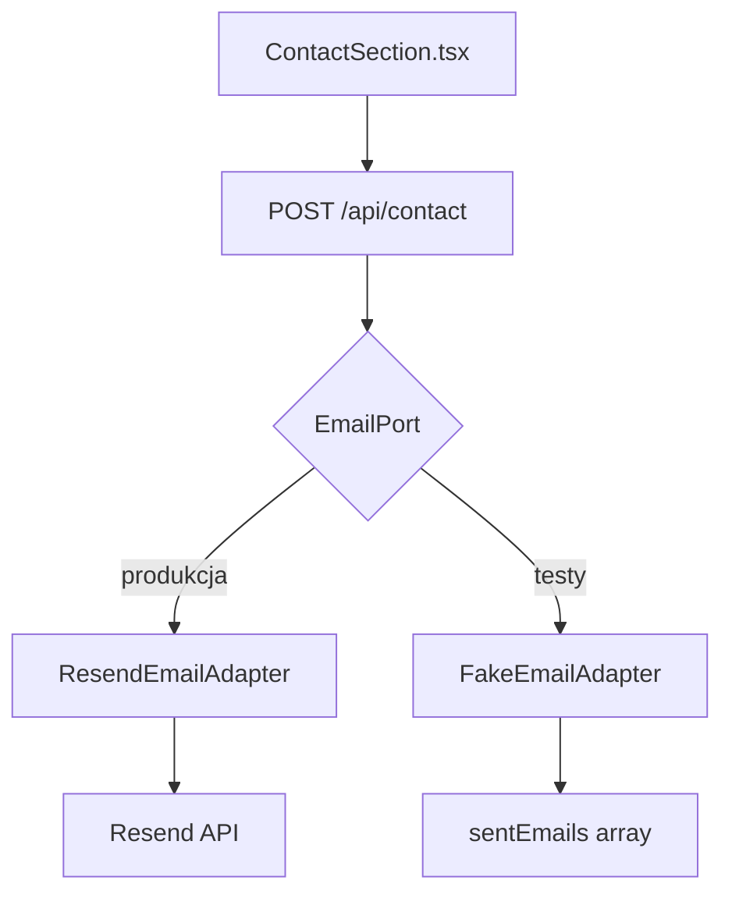

# Portfolio Bartosza Fornala

Osobista strona portfolio zaprojektowana w stylu magazynu prasowego (editorial design).
Prezentuje projekty, umiejętności i formularz kontaktowy. Służy jako wizytówka zawodowa
i plac ćwiczeń z nowoczesnym stackiem webowym.

**Live:** [moje-portfolio.vercel.app](https://moje-portfolio.vercel.app)
**Repozytorium:** [github.com/fornalbartosz3/moje-portfolio](https://github.com/fornalbartosz3/moje-portfolio)

---

## Stack

| Technologia | Wersja | Rola |
|---|---|---|
| Next.js | 16 | Framework (App Router) |
| React | 19 | UI |
| TypeScript | ^5 | Typowanie |
| Tailwind CSS | ^4 | Utility-first CSS |
| Framer Motion | ^12 | Animacje |
| Resend | ^6 | Wysyłanie emaili |
| next-themes | ^0.4 | Motywy (dark/light) |
| Radix UI | ^1 | Komponenty dostępności |
| shadcn/ui | ^4 | Biblioteka komponentów UI |
| Jest + Testing Library | ^30 / ^16 | Testy jednostkowe |

---

## Architektura

### Hexagonal Architecture — formularz kontaktowy

Formularz kontaktowy używa wzorca portów i adapterów, co pozwala na wymianę
providera emaili bez zmiany logiki biznesowej.



- **Port** (`lib/ports/email.port.ts`) — definiuje kontrakt `sendContactEmail(payload)`
- **ResendEmailAdapter** (`lib/adapters/resend.adapter.ts`) — implementacja produkcyjna
- **FakeEmailAdapter** (`lib/adapters/fake-email.adapter.ts`) — implementacja testowa
- **Route** (`app/api/contact/route.ts`) — zna tylko `EmailPort`, nie zna konkretnego adaptera

### Struktura katalogów

```
moje-portfolio/
├── app/                    # Next.js App Router (strony, API routes, layout)
├── components/             # Komponenty React (sekcje, Navbar, Footer)
│   └── ui/                 # Bazowe komponenty shadcn/ui
├── lib/
│   ├── data/               # Dane statyczne (projekty)
│   ├── ports/              # Interfejsy (EmailPort)
│   └── adapters/           # Implementacje (Resend, Fake)
└── __tests__/              # Testy komponentów
```

---

## Uruchomienie lokalne

```bash
# 1. Klonuj repozytorium
git clone https://github.com/fornalbartosz3/moje-portfolio.git
cd moje-portfolio

# 2. Zainstaluj zależności
npm install

# 3. Skonfiguruj zmienne środowiskowe
cp .env.local.example .env.local
# Uzupełnij RESEND_API_KEY w .env.local

# 4. Uruchom serwer deweloperski
npm run dev
```

Otwórz [http://localhost:3000](http://localhost:3000) w przeglądarce.

### Zmienne środowiskowe

| Zmienna | Wymagana | Opis |
|---|---|---|
| `RESEND_API_KEY` | TAK | Klucz API Resend (formularz kontaktowy) |
| `CONTACT_EMAIL` | NIE | Email docelowy (domyślnie: `twoj@email.com`) |

### Testy

```bash
npm test                          # Jeden przebieg
npm run test:watch                # Tryb watch
npx jest lib/contact.test.ts      # Konkretny plik
```

---

## Deployment

Projekt wdrażany automatycznie na [Vercel](https://vercel.com) przy każdym push na gałąź `main`.
